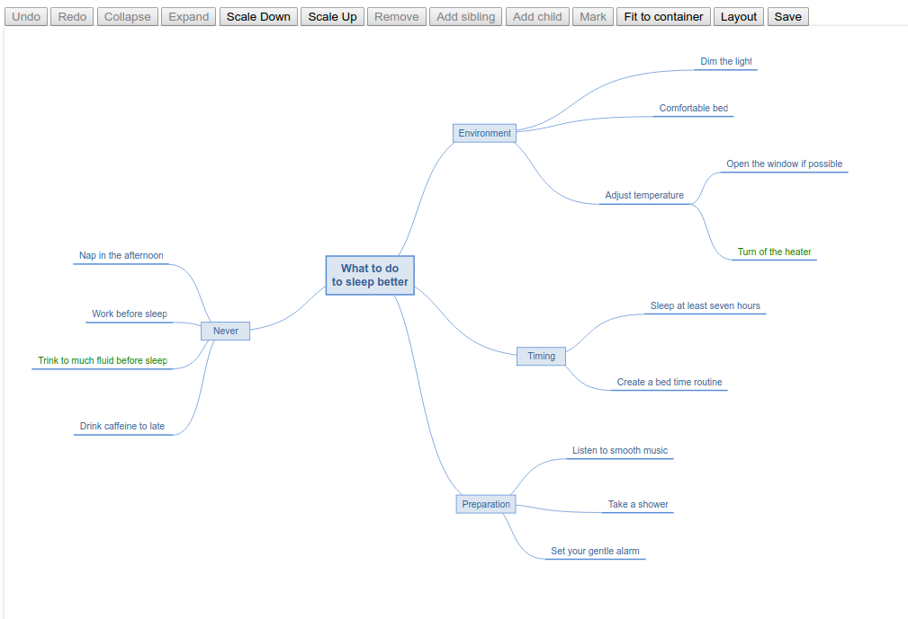

Twibs Mind Map is a small embeddable JavaScript library completely stylable via CSS 
with no dependencies.



## Details

It is written in TypeScript, compiled via `tsc` and minified using closure compiler.

Style of connection point position, distances of the ideas (nodes) and paths between
ideas is done by CSS only.

Connection path layout can be configured by overriding the appropriate function in JavaScript.

Minified JavaScript size is about 24kb, minified required css about 3kb.

## Quickstart

### test.ts
```javascript
///<reference path="../src/twibs-mind-map.ts"/>
const mm = TwibsMindMaps.init(document.querySelector(".tmm-container"));
mm.load('[{"id":1,"parentId":0,"title":"My mindmap","key":"","x":0,"y":0,"selected":false,"marked":false,"collapsed":false}]');
mm.clearUndoRedo();
mm.fitToContainer();
mm.onChanged = (mindMap) => {
  console.log(mindMap.save());
};
```
### test.scss
```scss
$tmm-idea-bg-color: lightgray;  // change default color of idea background
@import "src/twibs-mind-map";
.tmm > div.l2 {                 // add styles for second level ideas
  background-color: darkgray;
  margin: 3em 6em;              // give more space around idea 
}
```
### test.html
```html
<link rel="stylesheet" href="test.css"/>
<script src="test.js" defer></script>
...
<div class="tmm-container"></div>
```

## Building

The TypeScript compiler `tsc`, the SCSS compiler `sccs` and the Java command`java` must be in path. The path to the closure compiler jar must be given as first parameter.

```bash
build.sh ~/path/to/closure-compiler.jar
```

## Testing 

Open `test/test.html` in your browser and/or have a look at the files in the `test` folder. 

## Configure connection paths

```javascript
const mm = TwibsMindMaps.init(document.querySelector(".tmm-container"));
mm.toSvgPath = (level, from, to) => {
  if(1 == level) { 
    return "your computed svg path"; // see toCurvedSvgPath
  } else return mm.toCurvedSvgPath(level,from,to);
}
```

## Add default buttons

Twibs Mind Map comes with an easy way to add buttons for default functionality.

See `test/test.html` for a list of all available default actions.
 
```javascript
mm.attachButtons(document.queryElementById("your-toolbar-id"));
```

```html
<button data-tmm="undo">Undo</button>
```

> Do not attach multiple mind maps to the same button!

## History 

After trying some very good JavaScript mind map libraries ending up in more than 1000 lines of configuration 
without the expected result and about of 500k compressed JavaScript to embed in my appkication
I decided it is time for a new mind map - written in less than 1000 lines of code.

As I am a Scala developer I started with ScalaJS and managed it in less than 1000 lines - but resulting of 200k of compressed JavaScript code to embed.

So I decided to learn TypeScript by example and translated the Scala Twibs Mind Map to TypeScript, improving it a lot - and ended with 1000 lines of
TypeScript code and only 24k of compressed code.

As I have now idea how to put this in CDN, build it with nodejs (if necessary or recommended) or do automated front end tests, 
any help and suggestions are appreciated.

If you like (or use) the result: leave me a note.   
 
## Dependencies

None

## License

* GPLv3 - see [LICENSE](LICENSE) file
